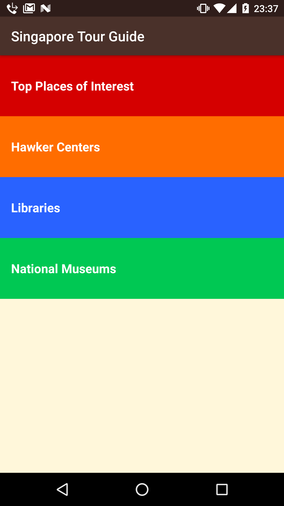
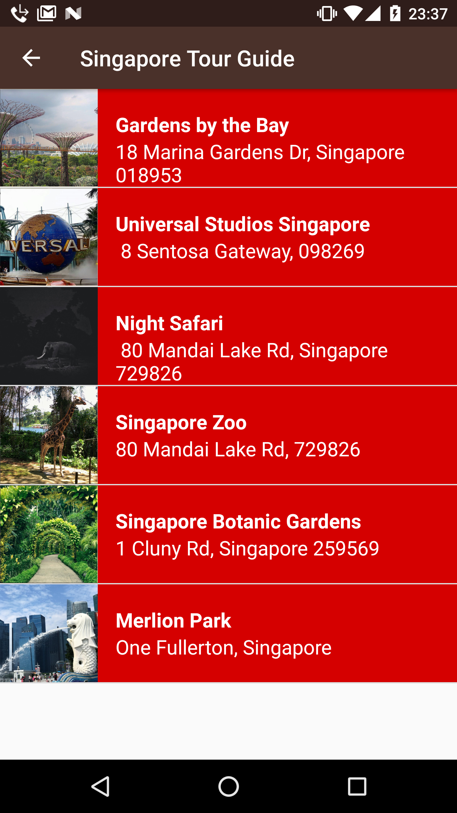
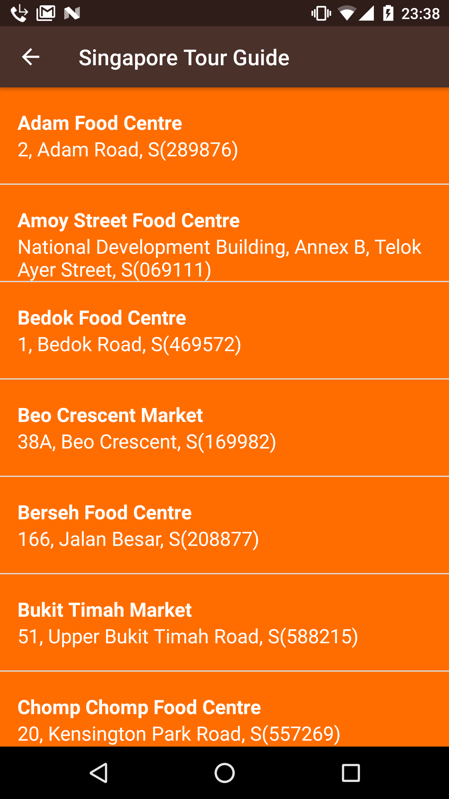
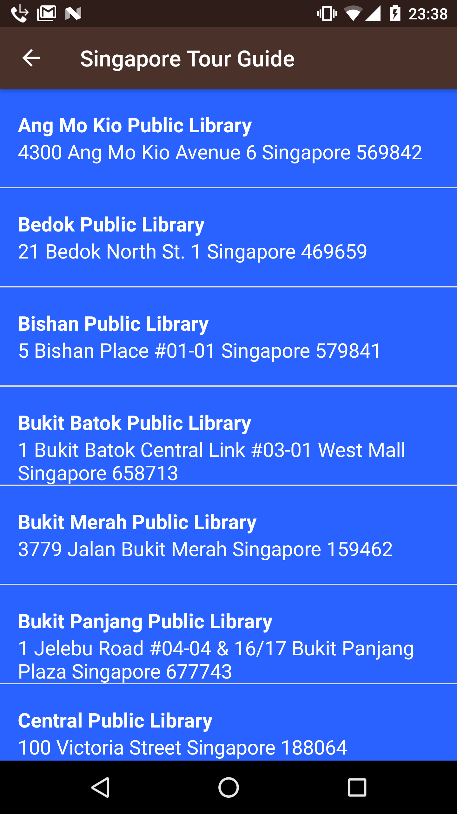

# Android Singapore Guide App

- Project **Tour Guide** of Android Basics Nanodegree
- [Android Basics Nanodegree at Udacity.com](https://www.udacity.com/course/android-basics-nanodegree-by-google--nd803).

## Android Items
- ListView.
- ArrayAdapter.
- ArrayLists.
- POJO.

## Description
- Tour Guide app of Singapore.
- It contains a list of sights, museums, libraries and hawker centers. 

## Screenshots
 

 